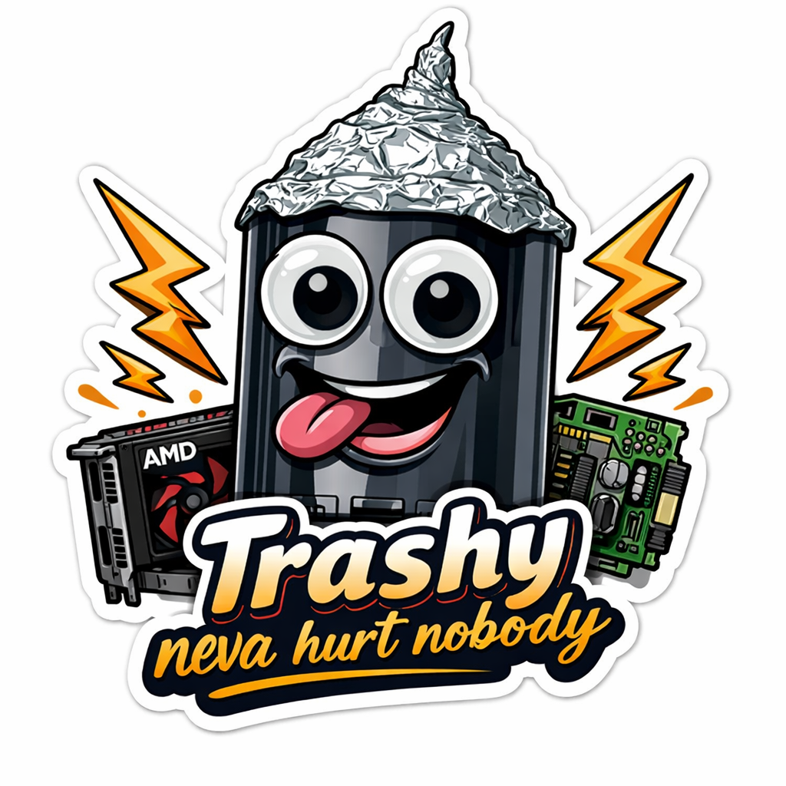

# TrashClaw

<p align="center">
  
</p>

*"Born from a rejected PR. Built different."*

A general-purpose local agent that runs on anything — from a 2013 Mac Pro trashcan to a PowerBook G4 to an IBM POWER8 mainframe. No cloud, no API keys, no dependencies beyond Python 3.7 and any local LLM server.

**14 tools. 17 commands. Plugin system. Achievements. Zero dependencies.**

## What it does

TrashClaw is a tool-use agent. You describe a task, the LLM decides what tools to call, sees the results, and iterates. Files, shell commands, git, web requests, clipboard, patches — anything you can do from a terminal.

```
trashclaw myproject (main)> find all TODO comments and create a tracking issue

  [search] /TODO|FIXME|HACK/
  [git] status
  [think] Found 12 TODOs across 5 files. Let me organize by priority...
  [write] TODO_TRACKING.md
  [git] commit: Add TODO tracking document

  Created TODO_TRACKING.md with 12 items organized by priority.
  Committed to main. Here's the breakdown:
  - 4 critical (auth, data validation)
  - 5 moderate (error handling, logging)
  - 3 minor (formatting, comments)
```

It's not a chatbot. It's an agent that does things on your machine.

## Quick Start

```bash
# Start any local LLM server, then:
python3 trashclaw.py

# Or with Ollama:
TRASHCLAW_URL=http://localhost:11434 python3 trashclaw.py

# Or point at any OpenAI-compatible endpoint:
TRASHCLAW_URL=http://your-server:8080 python3 trashclaw.py